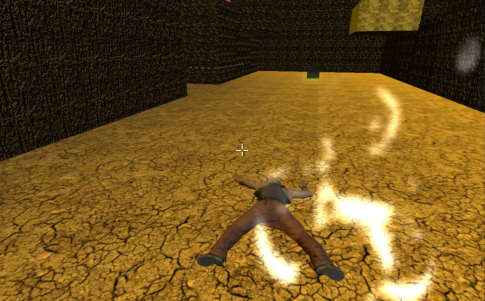
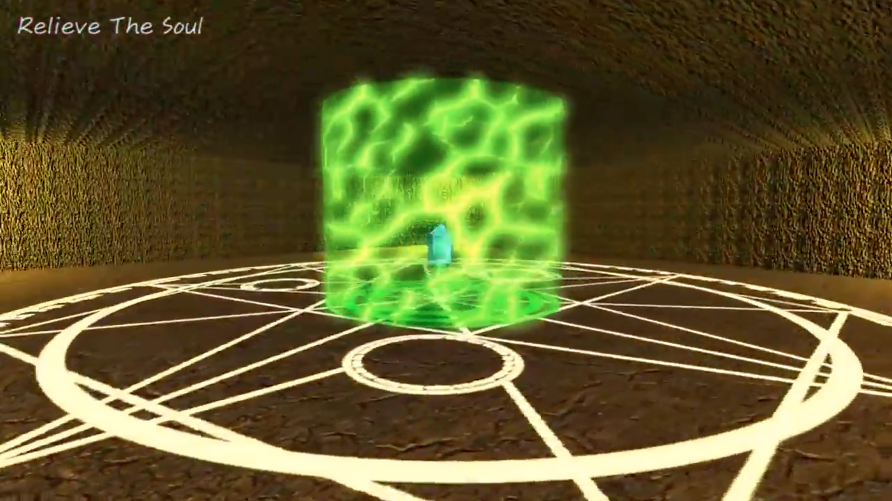
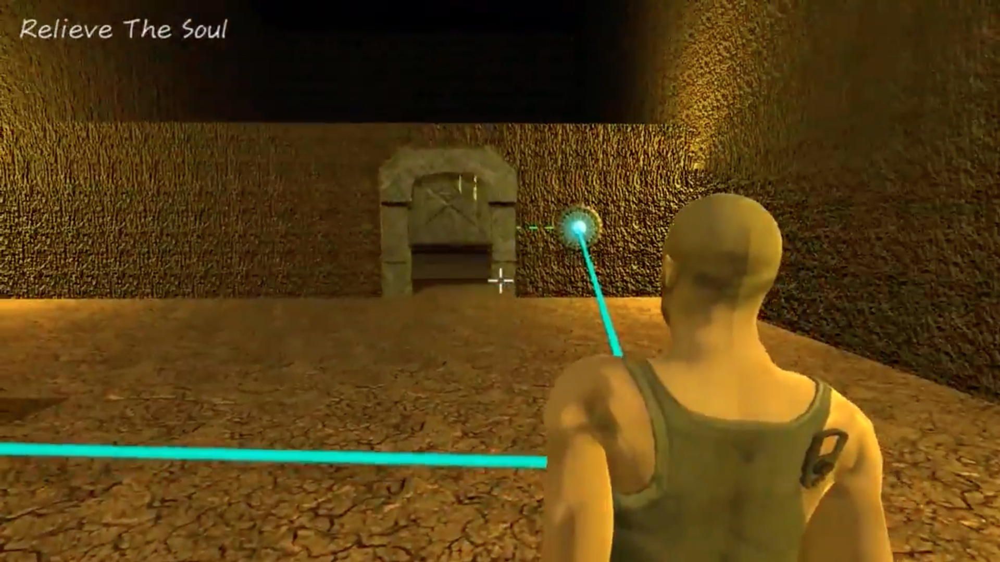
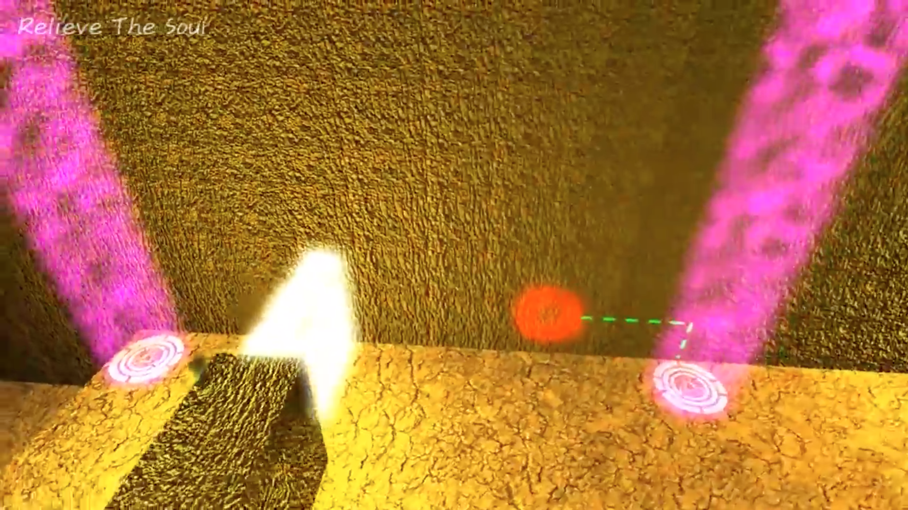
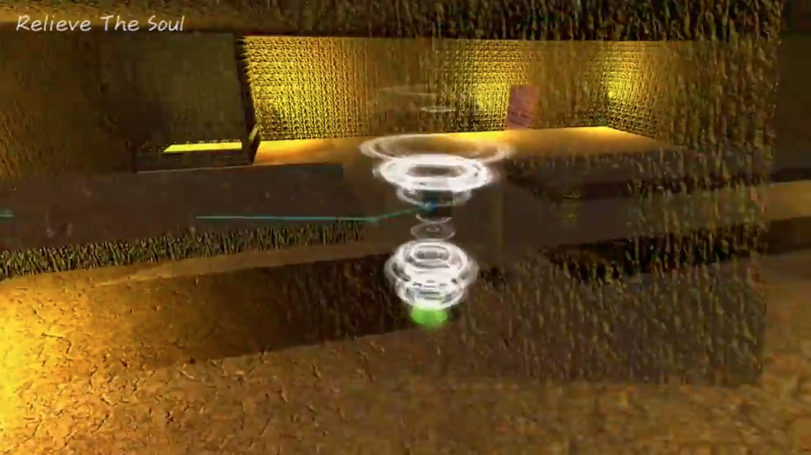
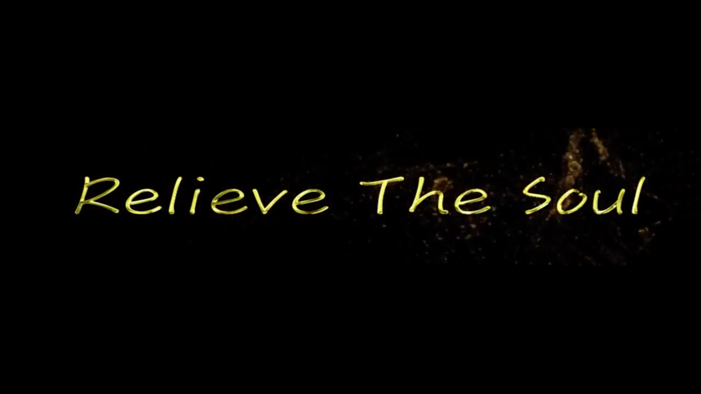

# GameDesign_RelieveTheSoul

### Indroduction:
+ A 3D action puzzle-platform game developed with the concept of Out-of-body experience(OBE).
+ The character in the game has ability to float outside the body and interact with some puzzles which are invisible in physical.

+ Based on the noval gameplay,the player need to think more about the physical law and try to use the features from both body and soul.

### Game Scene:

### Video:

### Project:
*  [https://drive.google.com/drive/u/1/folders/1DMCxR009bJspoFklFk9Csy7Rs-S3ANJN](https://drive.google.com/drive/u/1/folders/1DMCxR009bJspoFklFk9Csy7Rs-S3ANJN)
